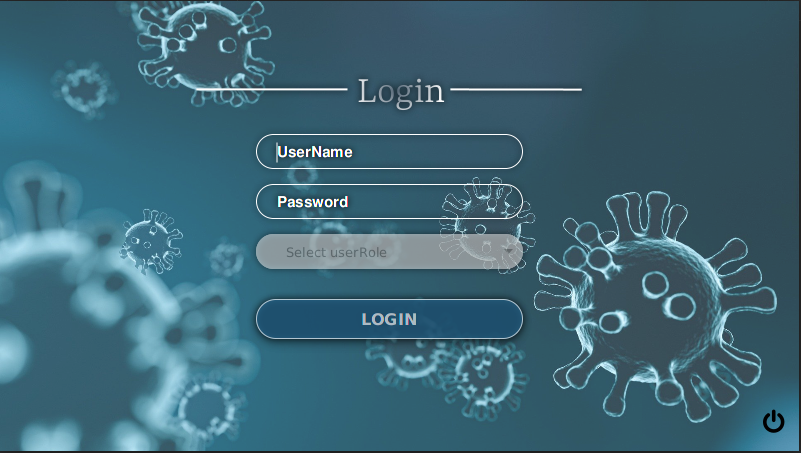
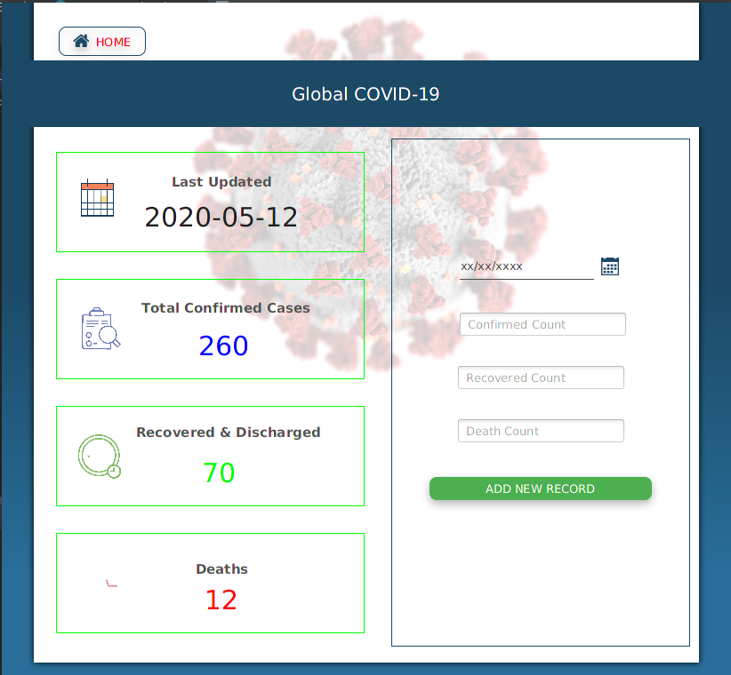
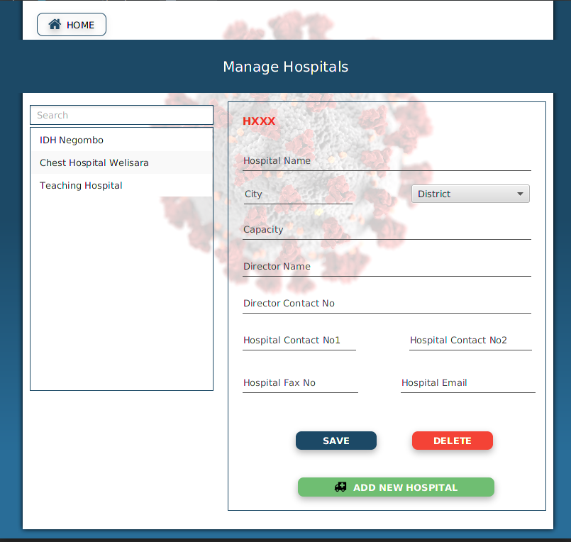
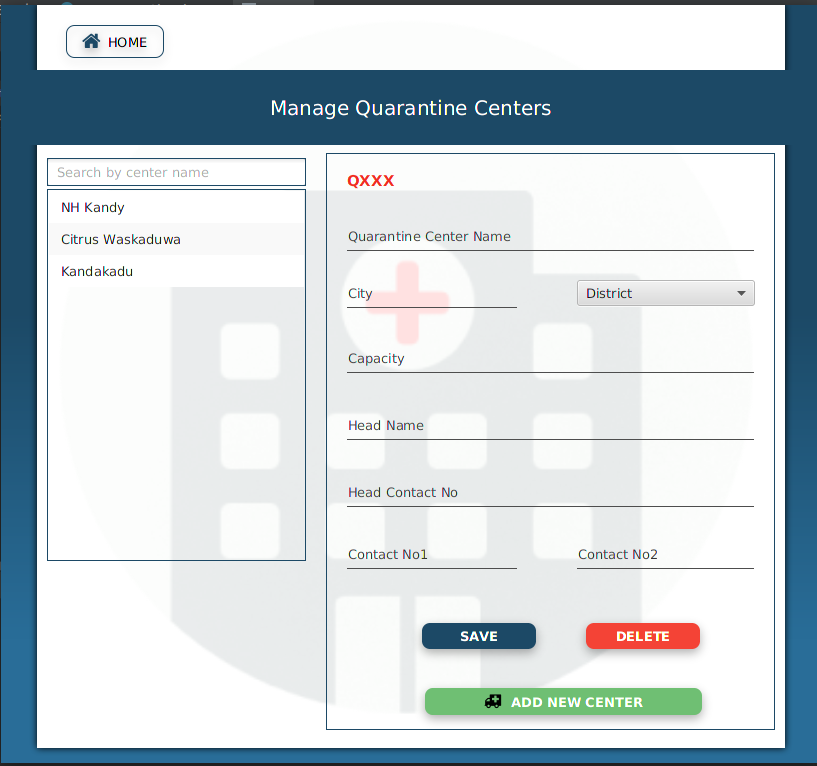
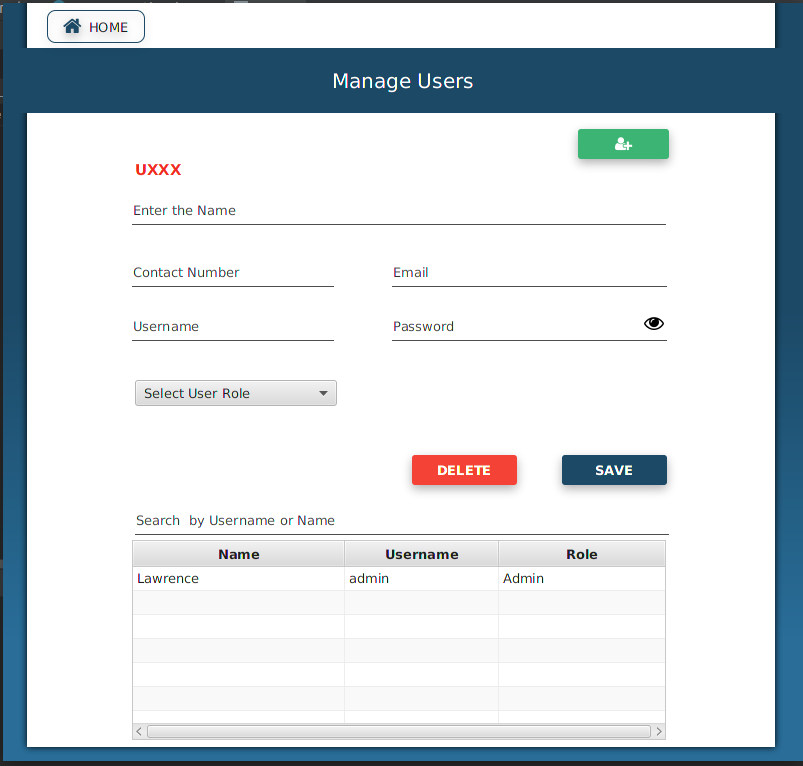

## Introduction

System has developed by using Java, JDBC and MySQL.
Java Database Connectivity (JDBC) is an application programming interface (API) for the programming language 
Java, which defines how a client may access a database. It is a Java-based data access technology used for 
Java database connectivity. It is part of the Java Standard Edition platform, from Oracle Corporation.

Using this system you can **manage global covid details, hospitals, quarantine centers and system users**.

#### Login

#### Covid Details

#### Manage Details

#### Manage Quarantine Centers

#### Manage Users

## Requirements

* Before use this application you must need to install [JAVA](https://www.oracle.com/java/technologies/javase/javase-jdk8-downloads.html) runtime environment and [MYSQL](https://www.mysql.com/) database management services.

#### Required JAR files
* [JFoenix](http://www.jfoenix.com/) - is an open source Java library, that implements Google Material Design using Java components
* [FontAwesomeFX-8.2](https://bitbucket.org/Jerady/fontawesomefx/downloads/) - FontAwesomeFX is an open source library adding Web Icons support to your JavaFX Apps! Including FontAwesome, WeatherIcons, Google Material Icons.
* [MySQL Connector](https://dev.mysql.com/downloads/connector/j/) - MySQL Connector/J is the official JDBC driver for MySQL.

## Installation

 1. Clone or Download the repository.
 2. Create a Database using script.sql which is in the project directory.
 3. Download the required library files.
 4. Create a lib file inside the project directory and copy those jar files into that.
 5. Find Database Configuration From src/dbConnection, and set your Database name,user name and password.
 6. Test it!.
 
## Features

1. System users can only logging to the system via using their user name, 
password and role.They cannot enter the system without  those things.
2. Can get the exact details about confirmed cases, recovered, discharged, and death cases through this system.
3. Can Search about hospitals and quarantine centers through this system.
4. Only admins  have the authority to do anything  in this system.

## License

Distributed under the MIT License. See [License](LICENSE) for more information.
